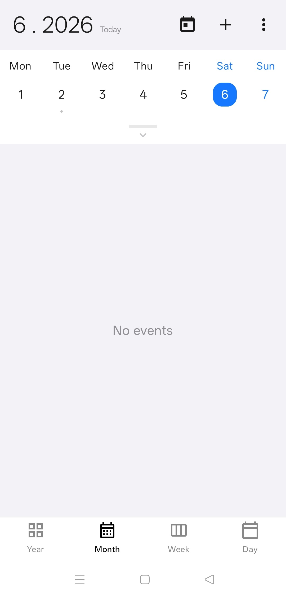
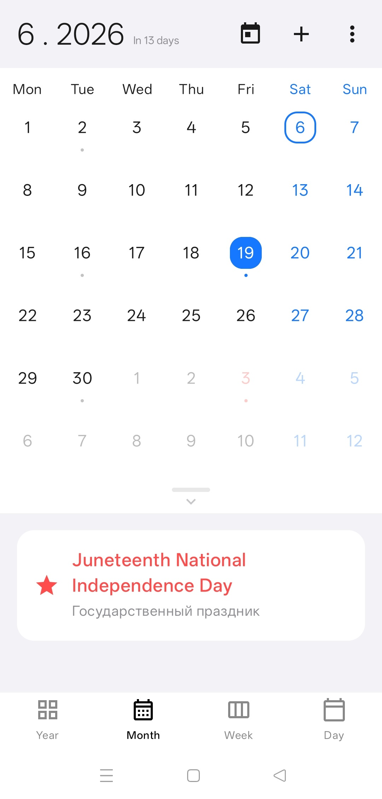
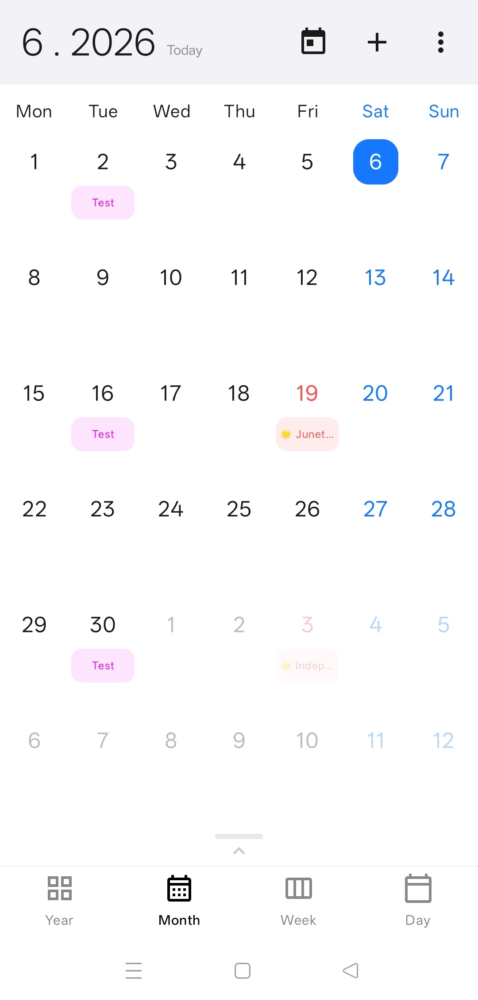
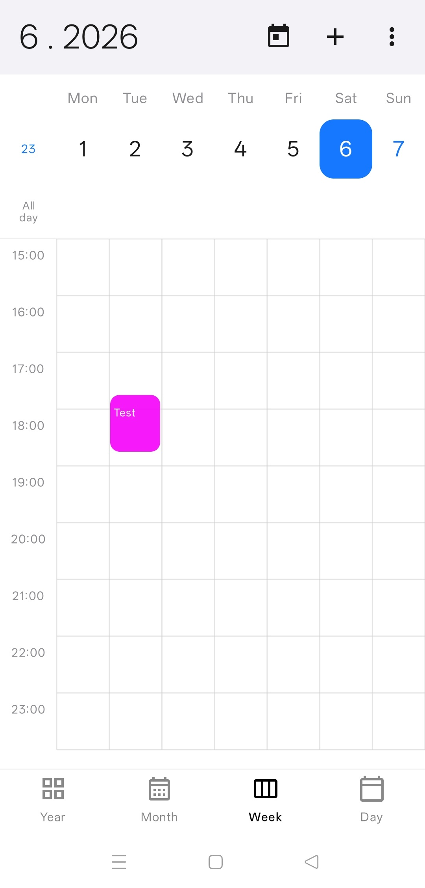
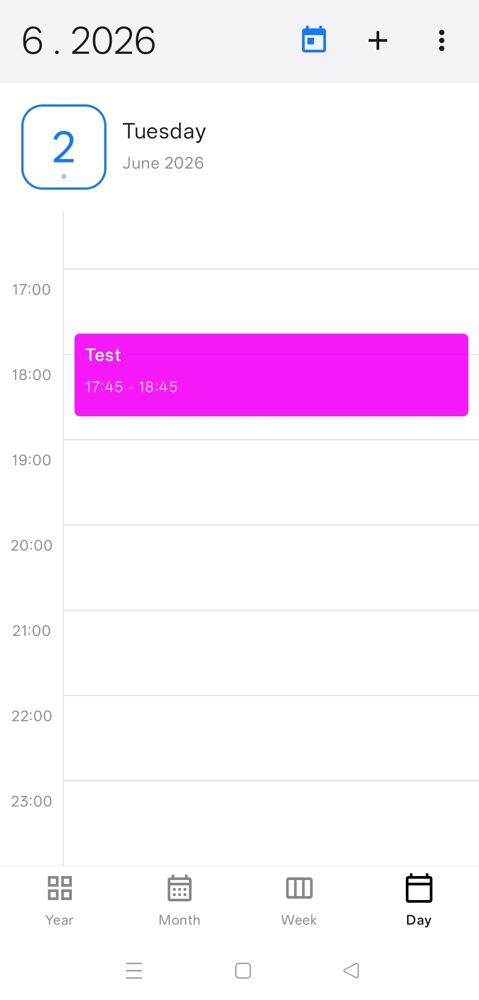
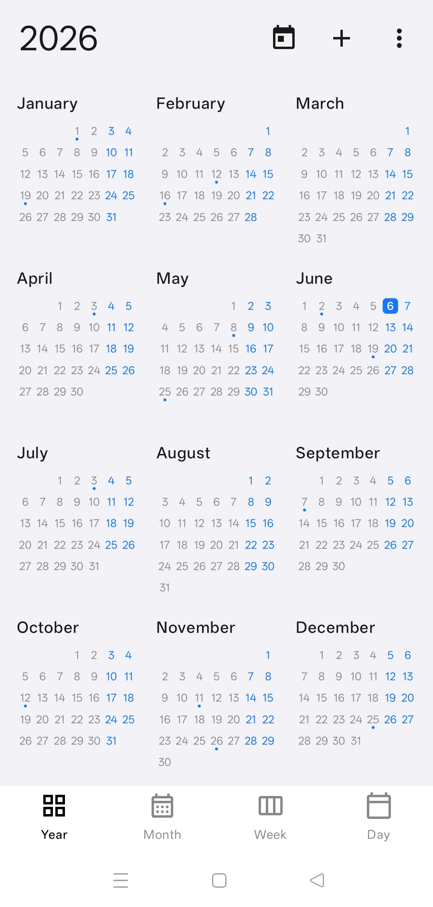
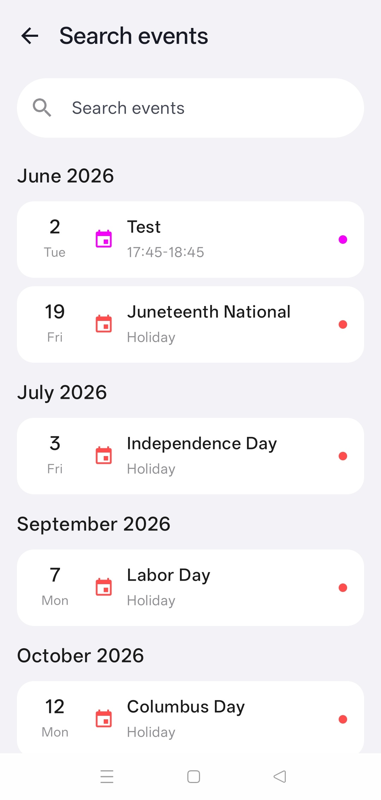
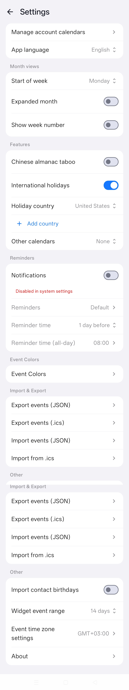
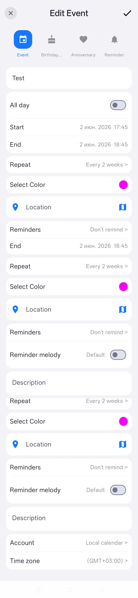

# Calendar App

Modern Android application for calendar and event management, built with Jetpack Compose and Material 3.

## Features

- **Multiple View Modes**: Month, Week, and Day views for flexible scheduling.
- **Event Management**:
    - Create, edit, and delete events.
    - Support for different event types (Regular Events, Reminders).
- **Flexible Reminder System**:
    - Reminders are optional and can be toggled off.
    - Custom reminder time selection via a Wheel Picker (from 1 minute to 60 minutes, or hours/days/weeks).
    - Dynamic notification lead time calculation.
- **Holidays Integration**:
    - Support for displaying public holidays.
    - **Multi-country support**: Track holidays from multiple countries simultaneously.
    - Holiday names displayed directly within the calendar grid.
- **Localization**: Multi-language interface support.
- **Modern UI**: Fully implemented in Jetpack Compose following Material 3 guidelines with responsive layout.

## Screenshots

| Month View | Month View Expanded | Month View with Events |
|:---:|:---:|:---:|
|  |  |  |

| Week View | Day View |
|:---:|:---:|
|  |  |

| Year View | Search Events |
|:---:|:---:|
|  |  |

### Scrolling Screenshots

| Settings | Edit Event |
|:---:|:---:|
|  |  |

## Technical Stack

- **Language**: Kotlin
- **UI Framework**: Jetpack Compose
- **Architecture**: MVVM (Model-View-ViewModel)
- **Database**: Room (for local storage of events and settings)
- **Dependency Management**: Gradle (Kotlin DSL) with Version Catalogs.

## Project Structure

- `app/src/main/java/danilovl/calendar/ui`: UI components and screens (MonthView, WeekView, AddEventScreen, etc.).
- `app/src/main/java/danilovl/calendar/data`: Repositories and data sources (Settings, Holidays, Events).
- `app/src/main/java/danilovl/calendar/domain`: Business logic and Use Cases.
- `app/src/main/java/danilovl/calendar/util`: Utility classes for date handling and formatting.

## Prerequisites

- **JDK 17 or 21**: Required for modern Gradle and Android build tools.
- **Android Studio**: Ladybug (2024.2.1) or later recommended.
- **Android SDK**:
    - Min SDK: 26 (Android 8.0)
    - Target SDK: 36 (Android 15+)

## Build and Run

1. Clone the repository: `git clone <repository-url>`
2. Open the project in Android Studio.
3. Sync Gradle and build the project.
4. Run on an emulator or a physical device (API 26+).

### Command Line Build

To build the debug APK:
```bash
# On Unix-like systems (Linux, macOS)
./gradlew assembleDebug

# On Windows
.\gradlew.bat assembleDebug
```
The output APK will be located at `app/build/outputs/apk/debug/app-debug.apk`.

To build the release APK:
```bash
# On Unix-like systems (Linux, macOS)
./gradlew assembleRelease

# On Windows
.\gradlew.bat assembleRelease
```
The output APK will be located at `app/build/outputs/apk/release/app-release-unsigned.apk`.

To run unit tests:
```bash
./gradlew test
```

To run static analysis (Lint):
```bash
./gradlew lint
```

## Localization

The app supports multiple languages. Strings are located in `app/src/main/res/values-*/strings.xml`. To contribute a new translation, create a new `values-<lang>` folder and add `strings.xml`.


## MIT License
-----------

Calendar application is completely free and released under the [MIT License](https://github.com/danilovl/calendar-app-android/LICENSE).

## Author
-------

Created by [Vladimir Danilov](https://github.com/danilovl).